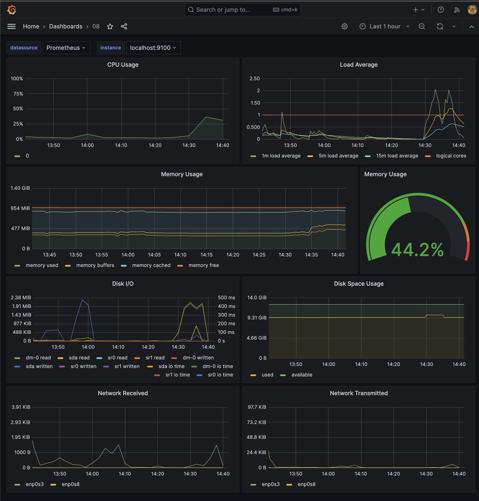
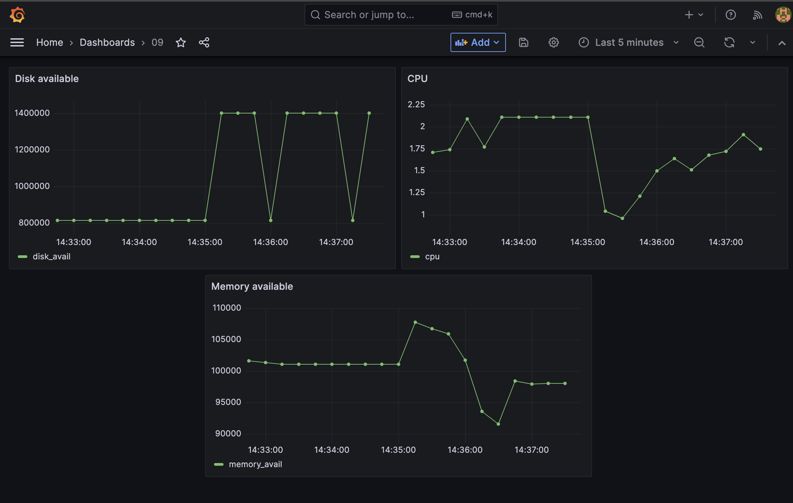

# LinuxMonitoring v2.0

Мониторинг и исследование состояния системы в реальном времени.

Каждое задание x расположено в 0x/main.sh.

Запуск на Ubuntu 20.04.4 LTS.

## Contents

1. [Генератор файлов](#part-1-генератор-файлов)  
2. [Засорение файловой системы](#part-2-засорение-файловой-системы)  
3. [Очистка файловой системы](#part-3-очистка-файловой-системы)  
4. [Генератор логов](#part-4-генератор-логов)  
5. [Мониторинг](#part-5-мониторинг)  
6. [GoAccess](#part-6-goaccess)  
7. [Prometheus и Grafana](#part-7-prometheus-и-grafana)  
8. [Готовый дашборд](#part-8-готовый-дашборд)  
9. [Дополнительно. Свой node_exporter](#part-9-дополнительно-свой-node_exporter)  

## Part 1. Генератор файлов

> Скрипт генерирует файлы заданного размера в указанной директории. В качестве параметров также передаются символы для генерации имен папок и файлов и количество папок и файлов в них.

- Пример. В папке /home/loretath/shared/01/buf/ будет сгенерировано 5 папок (abcd, aabcd, abbcd, abccd, abcdd), в каждой будет по 3 файла (qwer.txt, qqwer.txt, qwwer.txt), по 23 килобайта каждый.

```bash
bash main.sh /home/loretath/shared/01/buf 5 abcd 3 qwer.txt 23
```

_Информация о созданных файлах записывается в access_log в той директории, где был запущен скрипт._

## Part 2. Засорение файловой системы

> Скрипт генерирует файлы по всей системе до тех пор, пока больше 1 Гб свободного места в корневой директории. На ввод принимаются символы для имен директорий, файлов (с расширением) и размер в Mb. 

```sh
bash main.sh az az.az 3Mb
```
_Информация о созданных файлах записывается в access_log в той директории, где был запущен скрипт._

## Part 3. Очистка файловой системы

> Скрипт чистит систему тремя способами: 1) по файлу с логами; 2) по времени создания (не затрагивает системных); 3) по маске, используемой в пунктах выше.

- Протестировать можно, запустив скрипт test.sh (less для удобства просмотра вывода):

```sh
bash test.sh | less
```

## Part 4. Генератор логов

> Скрпит генерирует 5 файлов с логами nginx в combined формате.

|http-код| Значение |
|--|--|
|200|OK|
|201|Created|
|400|Bad Request|
|401|Unauthorized|
|403|Forbidden|
|404|Not Found|
|500|Internal Server Error|
|501|Not Implemented|
|502|Bad Gateway|
|503|Service Unavailable|

## Part 5. Мониторинг

> Простой анализ логов в терминале. В зависимости от выбранной аргументы скрипт выведет: 
1 - Все записи, отсортированные по коду ответа;
2 - Все уникальные IP, встречающиеся в записях;
3 - Все запросы с ошибками (код ответа - 4хх или 5хх);
4 - Все уникальные IP, которые встречаются среди ошибочных запросов.


- Протестировать можно через готовый скрипт test.sh

```sh
bash test.sh
```

## Part 6. **GoAccess**

> Воспользуемся готовой утилитой для анализа из прошлой логов. Установим goaccess на ubuntu и сгенерируем html-страничку с анализом логов.

```sh
html_output="logs_report.html"

if ! [[ -n $(dpkg -l | grep goaccess) ]];
then sudo apt install -y goaccess
fi

sudo touch $html_output && chmod 777 $html_output
goaccess ../04/access*.log --log-format=COMBINED > ./$html_output
```


## Part 7. **Prometheus** and **Grafana**

|Утилита| Порт | Обзор |
|--|--|--|
|Prometheus|9090|Получает метрики из разных сервисов и собирает их в одном месте.|
|Node exporter|9100|Небольшое приложение, собирающее метрики операционной системы и предоставляющее к ним доступ по HTTP. Prometheus собирает данные с одного или нескольких экземпляров Node Exporter.|
|Grafana|3000|Вишенка на торте:) Grafana отображает данные из Prometheus в виде графиков и диаграмм, организованных в дашборды.|

1. Обновим систему:

```bash
sudo apt-get update
sudo apt-get upgrade
```

2. На корпоративной сети стояли блокировки официального сайта https://dl.grafana.com/enterprise/release/grafana-enterprise_9.5.1_amd64.deb и https://github.com/prometheus/node_exporter/releases/download/v1.3.1/node_exporter-1.3.1.linux-amd64.tar.gz. Для решения проблемы с VPN были скачаны бинарник для графаны и архив для node_exporter и скачанные файлы были помещены в общую с виртуальной машиной папку.

3. Grafana:

```bash
sudo dpkg -i grafana-enterprise_9.5.1_amd64.deb
sudo systemctl start grafana-server
sudo systemctl enable grafana-server
sudo systemctl status grafana-server
```

- Для проверки запуска на ubuntu:
```bash
curl 127.0.0.1:3000
```

- Для запуска через браузер сделала проброс портов.


- Для первого входа в систему используется логин "admin" и пароль "admin".

4. Prometheus был установлен через менеджер пакетов:

```bash
sudo apt-get install prometheus
sudo systemctl start prometheus
sudo systemctl enable prometheus
sudo systemctl status prometheus
```


- Для проверки запуска на ubuntu:
```bash
curl 127.0.0.1:9090
```


4. Node_exporter был установлен аналогично grafana - через скачивание архива в общую папку с использованием vpn. Ссылка: https://ourcodeworld.com/articles/read/1686/how-to-install-prometheus-node-exporter-on-ubuntu-2004


```bash
# Extract Node Exporter and remove binary
tar xvf node_exporter-1.3.1.linux-amd64.tar.gz
cd node_exporter-1.3.1.linux-amd64
sudo cp node_exporter /usr/local/bin
cd ..
rm -rf ./node_exporter-1.3.1.linux-amd64

# Create an user in the system for Node Exporter
sudo useradd --no-create-home --shell /bin/false node_exporter
sudo chown node_exporter:node_exporter /usr/local/bin/node_exporter

# The node_exporter.service file
cp node_exporter.service /etc/systemd/system/node_exporter.service

# Reload the daemon with
sudo systemctl daemon-reload

sudo systemctl start node_exporter
sudo systemctl enable node_exporter
sudo systemctl status node_exporter
```


- Для проверки запуска на ubuntu:
```bash
curl 127.0.0.1:9100
```

- В браузере:


5. Для того, чтобы отразить метрики в grafana из prometheus, добавим data source "Prometheus" (инструкция: https://prometheus.io/docs/visualization/grafana/#creating-a-prometheus-data-source) и создадим дашборд. Используемые метрики:

- ЦПУ: `100 - (avg by (instance) (irate(node_cpu_seconds_total{job="node",mode="idle"}[5m])) * 100)`

- Свободная и доступная память: `node_memory_MemFree_bytes`, `node_memory_MemAvail_bytes`

- Свободное место: `node_filesystem_avail_bytes/node_filesystem_size_bytes*100`

- Количество операций ввода/вывода на жестком диске: `node_disk_io_now`


_Колодцы на графиках со свободным местом (Filesystem available size) и пики на графике с операциями ввода-вывода отражают запуск скрипта из 02/ с засорением системы и последующее удаление сгенерированных файлов._

_Пики на графиках с ЦПУ сопряжены со стресс-тестированием системы._

6. Запуск стресс-тестирования:

```bash
stress -c 2 -i 1 -m 1 --vm-bytes 32M -t 10s
```


## Part 8. Готовый дашборд

1. Скачаем Node Exporter Quickstart and Dashboard с официального сайта Grafana Labs: https://grafana.com/api/dashboards/13978/revisions/1/download.

2. Перейдем по ссылке http://localhost:3000/dashboard/import и загрузим скачанный json.


3. Готово! Проделала те же тесты, что в предыдущем таске, результаты на графах.



4. Склонируем машину и во внутренней сети настроим статическую маршрутизацию между двумя машинами. Склонированная машина будет сервером, исходная машина - клиентом. На сервере запустим `iperf3 -s`, на клиенте - `iperf3 -c <ip_addr>`. С запуском сетевой трафик во внутренней сети (enp0s8) заметно возрастет, что показывают пики на графике:


## Part 9. Дополнительно. Свой *node_exporter*

1. Сделала проброс портов 81:81, установила nginx. 

2. Редактировала nginx.conf, в котором обозначила, что сервер будет слушать порт 81, а также указала, что на страничке 127.0.0.1:81 будем отражать страницу nginx по умолчанию, а на 127.0.0.1:81/metrics - метрики. Далее именно с этой страницы в графане мы сможем отразить собранные метрики. Перезапустила nginx.

```bash
# nginx.conf
events {
}
http {
    server {
        listen 81;
        server_name localhost;
        root /usr/share/nginx/html/;
        index index.html;
        location /metrics {
            default_type "text";
            alias /home/loretath/shared/09/;
            index 9.html;
        }
	}
}
```

```bash
sudo cp nginx.conf /etc/nginx/nginx.conf 
sudo nginx -t
sudo service nginx restart
```

3. Написала скрипт, который собирает метрики. Метрики передаются в html-файл и записаны определенным образом -- так же, как в prometheus/metrics:

```bash
# Функция, собирающая метрики
get_metrics() {
    # Средний показатель загрузки за 1 мин
    cpu="$(cat /proc/loadavg | awk '{print $1}')"
    # Свободная оперативная память
    memory_avail="$(free | grep Mem | awk '{print $4}')"
    # Свободное место на диске
    disk_avail="$(df /| grep / | awk '{print $4}')"

    echo "# HELP cpu CPU info 1 min"
    echo "# TYPE cpu gauge"
    echo "cpu $cpu"

    echo "# HELP memory_avail available RAM"
    echo "# TYPE memory_avail gauge"
    echo "memory_avail $memory_avail"

    echo "# HELP disk_avail free disk space"
    echo "## TYPE disk_avail gauge"
    echo "disk_avail $disk_avail"
}
```

4. В prometheus.yml указала, что метрики будут собираться с 127.0.0.1:81 каждые 3 секунды:

```yml
scrape_configs:
  - job_name: 'my_export_node'
    scrape_interval: 3s
    scrape_timeout: 3s
    static_configs:
      - targets: ['127.0.0.1:81']
```

5. В grafana создала дашборд и выбрала свои метрики: 


